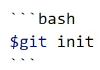

## md 원리
- markdown 파일은 플러그인(?)에 의해서 html 파일로 변환되어 브라우저에 출력된다.

---

## 머릿말 : md 파일의 가장 위에 작성해야 한다.
```
---
title: "markdown(.md) tutorial"
category: []
comments: true
toc_sticky: true
sitemap:
    changefreq: daily
    priority: 1.0
---
```
위는 현재 페이지의 머릿말을 나타낸 것이다.   
- `---`는 구분선으로, 머릿말을 포함하여 페이지를 나눌 때 사용한다.
- title : 해당 페이지의 출력되는 제목으로, 실제 파일명은 이와 일치하지 않아도 된다.
- layout : home, categories, single 등의 페이지 레이아웃을 지정 가능. 현재 페이지는 기본값이므로 생략 가능.
- permalink : `permalink: /git/`과 같은 방식으로 해당 페이지의 URL 절댓값을 지정. index.md이 아닌 경우는 주로 생략.
- category : 아무 값도 입력하지 않으면 계층법으로 분류된 상위 폴더명이 카테고리가 된다. 태그처럼 사용 가능.
- comments : 댓글 기능의 활성화 여부.
- toc_sticky : 해당 페이지의 side 목차를 생성하고 이를 고정시킬지의 여부. single layout이 아니면 toc는 사용 불가(?)
- sitemap changefreq : 해당 페이지에 대한 사이트맵의 갱신 주기.
- sitemap priority : 해당 파에지에 대한 사이트앱의 우선 순위.
- author_profile : 작성자 프로필에 대한 정보의 출력 여부(?). 보통 사이트의 메인 home layout에만 사용하면 됨.(?)

---

## 제목
- `#`의 개수(1~6)를 통해 html의 <h1> ~ <h6>을 대체.
- `##`에 한해서 제목 아래에 구분선이 생김.

---

## 기본 작성 규칙
- 해당 라인의 마지막에 space-bar 2번을 통해서 줄 바꿈(개행, newline) 가능.
- `(single grave) 쌍을 통해서 특정 문자가 코드임을 강조할 수 있음. html의 <code><pre>와 동일 표현.
- ```(single grave 3개) 쌍을 통해서 코드 블록을 생성 가능. bash, python와 같이 쌍의 첫번째 grave 라인 옆에 종류를 지정 가능.

- `-`를 이용하여 해당 라인의 머릿말 기호(●)를 사용 가능.
- `**` 쌍을 통해서 해당 문자에 bold(굵게) 적용 가능. (예시) `**강조**`
- `*` 쌍을 통해서 해당 문자에 기울임 적용 가능. (예시) `*기울임*`
- 주석은 `<!-- -->`로서 html과 동일.

---

## 링크 삽입과 이미지 삽입
- `[링크 제목](링크)`의 형식으로 사용 가능. (예시) `[내 홈페이지](https://daruvill.github.io/)`
- 링크에는 외부 페이지 뿐만 아니라, md 파일 내부의 다른 제목을 지정하는 것도 가능. (예시) `[링크 지정](#링크-지정)`
- 이미지 삽입의 경우 링크 삽입과 형식은 동일하지만 앞에 !를 붙여주면 됨. (예시) ``

---

## 특정 파일 내용 삽입
- ``와 같은 방식으로 사용 가능.

---

## 출처
[markdown 사용법 총정리](https://heropy.blog/2017/09/30/markdown/)

